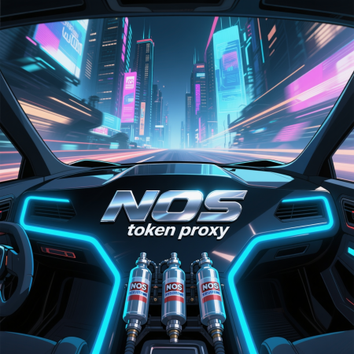

# 🚗💨 nos-token-proxy

<div align="center">
  
  
  ⚡ NITROUS OXIDE SYSTEM FOR YOUR API CALLS ⚡  
  🏁 TURBOCHARGED PROXY WITH TOKEN ROTATION 🏁
</div>

A high-performance OpenAI-compatible API proxy server with automatic API key rotation, token usage tracking, and streaming support. Built for speed, reliability, and scalability.

## 🚀 Features

- **⚡ Lightning Fast**: Minimal latency proxy for OpenAI-compatible APIs
- **🔄 Auto Key Rotation**: Automatically rotates through multiple API keys
- **📊 Token Tracking**: Real-time token usage monitoring and logging
- **🌊 Streaming Support**: Full support for SSE streaming responses
- **🛡️ CORS Ready**: Built-in CORS handling for web applications
- **💪 High Throughput**: Configurable payload limits up to 50MB
- **🔧 TypeScript**: Fully typed with modular architecture
- **🎯 Drop-in Replacement**: Compatible with OpenAI API format
- **🐳 Docker Ready**: Easy deployment with Docker and Docker Compose
- **🔄 API Format Mapping**: Automatic conversion between OpenAI and Anthropic API formats
- **🛠️ Tool Calling Support**: Full function/tool calling with bi-directional conversion
- **🧠 Smart Format Detection**: Auto-detects client API format and maps to target format
- **🔒 Robust Error Handling**: Graceful handling of HTML errors and malformed responses

## CLAUDE CODE COMPATIBLE WITH THE FOLLOWING

```bash
# Copy environment template
cp .env.example .env

# For openai compatible target url add '/api' suffix for TARGET_API_URL e.g.: https://openrouter.ai --> https://openrouter.ai/api
sed -i 's|^TARGET_API_URL=.*|TARGET_API_URL=https://openrouter.ai/api|' .env

# Set environment variable for claude to use nos-token-proxy
export ANTHROPIC_BASE_URL=http://localhost:4015

# Enjoy
claude

```

## 📦 Installation

### 🚀 Quick Start with Docker (Recommended)

```bash
# Clone the repository
git clone https://github.com/majus47/nos-token-proxy.git
cd nos-token-proxy

# Copy environment template
cp .env.example .env

# Configure your environment (see Configuration section)
nano .env

# Run with Docker Compose
docker-compose up -d
```

### 🐳 Docker Only

```bash
# Build the image
docker build -t nos-token-proxy .

# Run the container
docker run -d \
  --name nos-proxy \
  -p 4015:4015 \
  -e TARGET_API_URL="https://api.openai.com/v1" \
  -e API_KEYS="sk-key1,sk-key2,sk-key3" \
  -e MODEL="z-ai/glm-4.5-air:free" \
  nos-token-proxy
```

### 📋 Manual Installation

```bash
# Clone the repository
git clone https://github.com/majus47/nos-token-proxy.git
cd nos-token-proxy

# Install dependencies
npm install

# Copy environment template
cp .env.example .env

# Configure your environment (see below)
nano .env
```

## ⚙️ Configuration

Create a `.env` file in the root directory:

```env
# Target API URL (default: https://api.openai.com/v1)
TARGET_API_URL=https://api.openai.com/v1

# Multiple API keys for rotation (comma-separated)
API_KEYS=sk-key1,sk-key2,sk-key3,sk-key4

# Default model to use
MODEL=z-ai/glm-4.5-air:free

# Server port (default: 4015)
PORT=4015

# Target API format (openai|anthropic) - optional, defaults to client format
# TARGET_API_FORMAT=openai
```

### Environment Variables

| Variable | Required | Description | Default |
|----------|----------|-------------|---------|
| `TARGET_API_URL` | ✅ | The target API endpoint | `https://api.openai.com/v1` |
| `API_KEYS` | ✅ | Comma-separated list of API keys for rotation | - |
| `MODEL` | ✅ | Default model identifier | - |
| `PORT` | ❌ | Server port number | `4015` |
| `TARGET_API_FORMAT` | ❌ | Target API format (openai\|anthropic) | Auto-detected from client |

### Alternative Single Key Setup

For backward compatibility, you can use a single API key:

```env
API_KEY=your-single-api-key
```

## 🏁 Getting Started

### 🐳 Docker (Recommended)

```bash
# Start with Docker Compose
docker-compose up -d

# Check logs
docker-compose logs -f

# Stop the service
docker-compose down
```

### 📋 Manual Start

```bash
# Start the server
npm run start

# Start in development mode
npm run dev
```

**Server will be running at http://localhost:4015**

### Example Usage

Replace your OpenAI or Anthropic API calls with the proxy:

```javascript
// OpenAI Format
const response = await fetch('http://localhost:4015/v1/chat/completions', {
  method: 'POST',
  headers: {
    'Content-Type': 'application/json'
    // No Authorization header needed!
  },
  body: JSON.stringify({
    model: 'gpt-4', // Will be automatically replaced with your configured model
    messages: [
      {role: 'system', content: 'You are helpful'},
      {role: 'user', content: 'Hello!'}
    ],
    tools: [
      {
        type: 'function',
        function: {
          name: 'get_weather',
          description: 'Get current weather',
          parameters: {
            type: 'object',
            properties: {
              location: {type: 'string'}
            }
          }
        }
      }
    ],
    stream: true
  })
});

// Anthropic Format  
const response = await fetch('http://localhost:4015/v1/messages', {
  method: 'POST',
  headers: {
    'Content-Type': 'application/json'
  },
  body: JSON.stringify({
    model: 'claude-3-sonnet',
    max_tokens: 1024,
    system: 'You are helpful',
    messages: [
      {role: 'user', content: 'Hello!'}
    ],
    tools: [
      {
        name: 'get_weather',
        description: 'Get current weather',
        input_schema: {
          type: 'object',
          properties: {
            location: {type: 'string'}
          }
        }
      }
    ]
  })
});
```

## 🔄 API Format Mapping

The proxy automatically detects and converts between API formats:

### **Automatic Detection**
- **Client sends OpenAI format** (`/v1/chat/completions`) → Auto-detected
- **Client sends Anthropic format** (`/v1/messages`) → Auto-detected  
- **Target format** configured via `TARGET_API_FORMAT` environment variable

### **Supported Conversions**
- ✅ **OpenAI ↔ Anthropic** message formats
- ✅ **Tool/function calling** conversion
- ✅ **System prompts** handling
- ✅ **Streaming responses** conversion
- ✅ **Token usage** normalization

### **Example Scenarios**
```bash
# Client sends Anthropic → Target expects OpenAI
curl -X POST http://localhost:4015/v1/messages \
  -d '{"model":"claude","max_tokens":100,"messages":[...]}'
# Automatically converted to OpenAI chat/completions format

# Client sends OpenAI → Target expects Anthropic  
curl -X POST http://localhost:4015/v1/chat/completions \
  -d '{"model":"gpt-4","messages":[...]}'
# Automatically converted to Anthropic messages format
```

## 🏗️ Architecture

```
src/
├── app.ts                 # Main application entry point
├── types/
│   ├── index.ts          # Main TypeScript interfaces
│   └── api.ts            # API format type definitions
├── middleware/
│   └── cors.ts           # CORS handling
├── services/
│   ├── streamingService.ts    # Streaming request handler
│   └── nonStreamingService.ts # Non-streaming request handler
├── routes/
│   └── proxy.ts          # Main proxy route handler
├── utils/
│   ├── tokenUsage.ts     # Token usage extraction and logging
│   ├── formatDetector.ts # API format detection logic
│   └── apiMapper.ts      # API format conversion logic
└── config/
    └── server.ts         # Server configuration
```

## 📊 Token Usage Monitoring

The proxy automatically logs token usage for both streaming and non-streaming requests:

```
Token usage: 120 (prompt: 21, completion: 99)
Cached tokens: 20
```

## 🔄 API Key Rotation

Keys are rotated automatically on each request:

```
Using API key 1/4 (rotated)
Using API key 2/4 (rotated)
Using API key 3/4 (rotated)
Using API key 4/4 (rotated)
Using API key 1/4 (rotated) # Cycles back to first key
```

## 🛠️ Development

### 📋 Local Development

```bash
# Install dependencies
npm install

# Start development server with hot reload
npm run dev

# Build for production
npm run build

# Run linting
npm run lint
```

### 🐳 Docker Development

```bash
# Build development image
docker build -t nos-token-proxy:dev .

# Run with volume mounting for live changes
docker run -d \
  --name nos-proxy-dev \
  -p 4015:4015 \
  -v $(pwd):/app \
  -v /app/node_modules \
  nos-token-proxy:dev
```

## 🐳 Docker Commands

```bash
# Build image
docker build -t nos-token-proxy .

# Run container
docker run -d --name nos-proxy -p 4015:4015 nos-token-proxy

# View logs
docker logs nos-proxy

# Stop container
docker stop nos-proxy

# Remove container
docker rm nos-proxy

# Docker Compose
docker-compose up -d          # Start services
docker-compose down           # Stop services  
docker-compose logs -f        # View logs
docker-compose ps             # Check status
docker-compose restart       # Restart services
```

## 🐛 Troubleshooting

### PayloadTooLargeError

If you encounter "request entity too large" errors, the proxy is configured to handle up to 50MB payloads. You can adjust this in `src/app.ts`:

```typescript
app.use(express.json({ limit: '100mb' })); // Increase limit
```

### CORS Issues

The proxy includes comprehensive CORS handling. If you still encounter CORS issues, check that your client is making requests to the correct proxy endpoint.

### Streaming Not Working

Ensure your client properly handles Server-Sent Events (SSE) and that the `stream: true` parameter is included in your request body.

### API Format Mapping Issues

If you experience issues with format conversion:

```bash
# Check if TARGET_API_FORMAT is set correctly
echo $TARGET_API_FORMAT

# Enable debug logging to see format detection
docker-compose logs -f nos-proxy | grep "Request mapping"

# Test format detection manually
curl -X POST http://localhost:4015/v1/messages \
  -H "Content-Type: application/json" \
  -d '{"model":"test","max_tokens":10,"messages":[{"role":"user","content":"test"}]}'
```

### Docker Issues

If you encounter Docker-related problems:

```bash
# Check container status
docker ps -a

# View container logs
docker logs nos-proxy

# Restart container
docker restart nos-proxy

# Rebuild image
docker build --no-cache -t nos-token-proxy .
```

## 📝 API Endpoints

| Endpoint | Method | Description |
|----------|--------|-------------|
| `/v1/chat/completions` | `POST` | OpenAI chat completions |
| `/v1/messages` | `POST` | Anthropic messages |
| `/*` | `ALL` | Proxy any OpenAI-compatible endpoint |

### Supported Features per Endpoint

| Feature | `/chat/completions` | `/messages` |
|---------|:------------------:|:-----------:|
| Text Generation | ✅ | ✅ |
| Tool Calling | ✅ | ✅ | 
| Streaming | ✅ | ✅ |
| Format Conversion | ✅ | ✅ |
| Token Tracking | ✅ | ✅ | 

### Utility Endpoints
| Feature | `/v1/embeddings` |
|---------|:------------------:|
| Vector Generation | ✅ |
| Batch Porcessing | ✅ |
| Token Tracking | ✅ |
| Pass-through | ✅ |

## 🚦 Performance Tips

1. **Use Multiple Keys**: Configure multiple API keys for better rate limit handling
2. **Enable Streaming**: Use `stream: true` for real-time responses
3. **Monitor Logs**: Keep an eye on token usage to optimize costs
4. **Load Balancing**: Run multiple proxy instances behind a load balancer for high availability
5. **Docker Deployment**: Use Docker for consistent deployments across environments
6. **API Format Flexibility**: Use any client format with any target API through automatic conversion

## 📄 License

MIT License - see [LICENSE](LICENSE) file for details.

## 🤝 Contributing

1. Fork the repository
2. Create a feature branch
3. Make your changes
4. Add tests if applicable
5. Submit a pull request

## 🙏 Acknowledgments

- Inspired by the NOS system from The Fast and the Furious franchise
- Built and prompted for the AI community with ❤️

---

**🏁 Ready to boost your API calls? Fire up the NOS Token Proxy and leave your rate limits in the dust! 🏁**